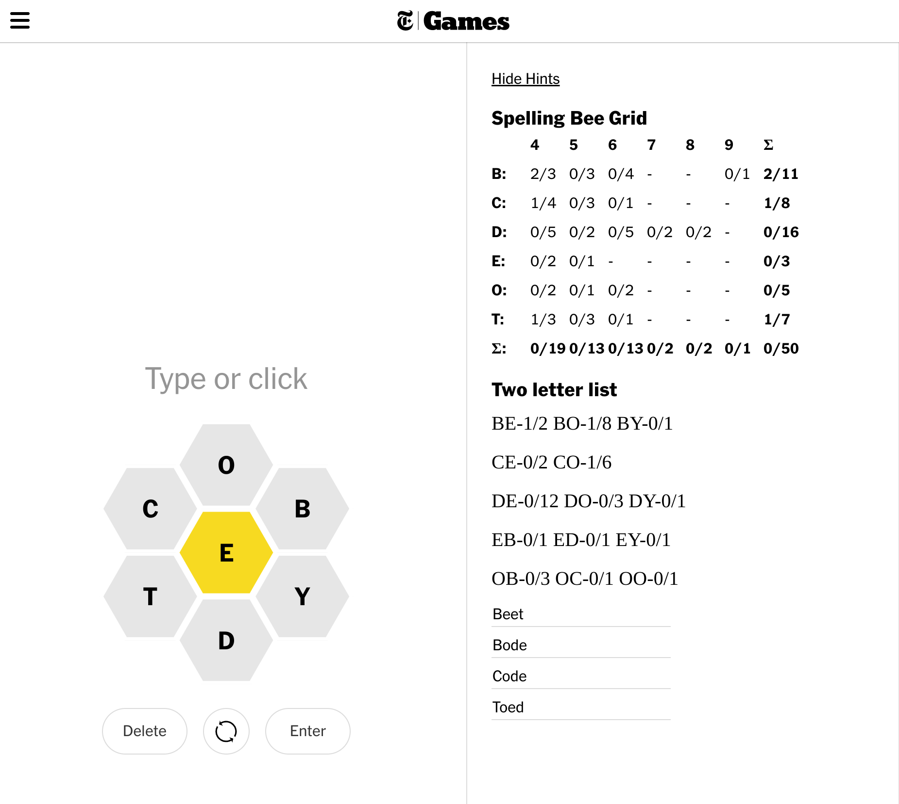

# Beehint 

> A browser extension which makes NYT's spellingbee hints easier to read. 

I've been playing [NYT's spellingbee game](https://www.nytimes.com/puzzles/spelling-bee) for a few months. It's super fun, but often challenging enough to need hints. Unfortunately they present the hints in a [format that is cumbersome to read](https://www.nytimes.com/2022/11/25/crosswords/spelling-bee-forum.html) and often takes time and skills unrelated to game to work out which type of words are still left in play. Beehint is a browser extension which makes NYT's spellingbee hints easier to read. 

## How to use it

* Clone or "download the zip" of this repo to your local machine.
* [Then load the extension into chrome](https://www.instructables.com/How-to-Load-Unpacked-Extension-in-Chrome-Easy/)
