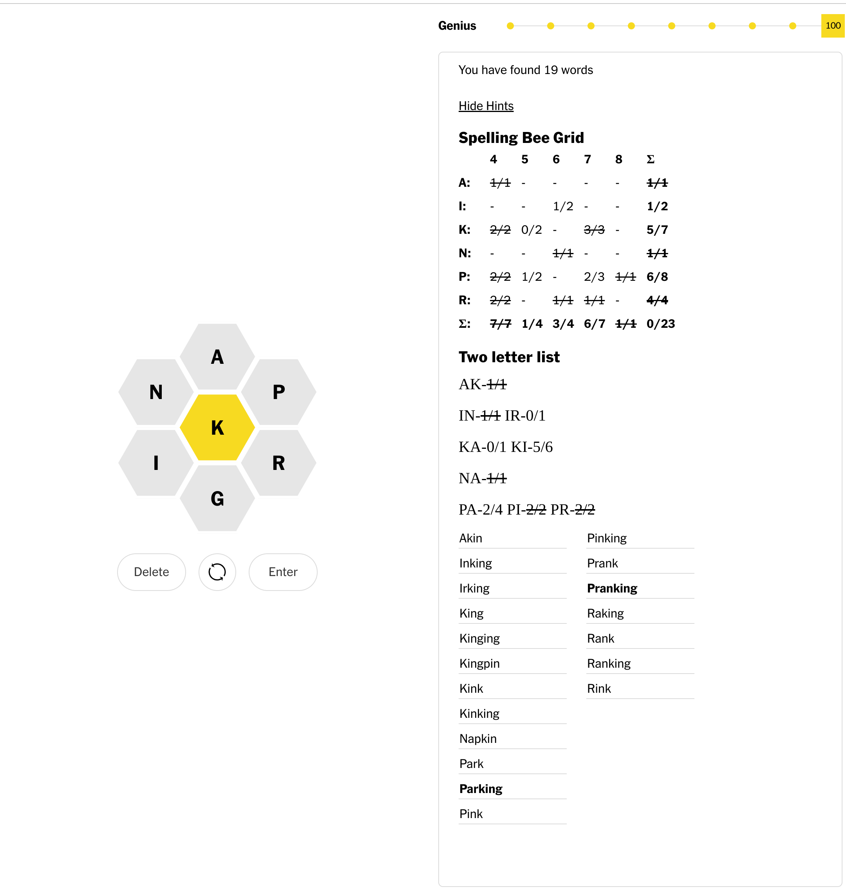

# Beehint 

> Calculates hints for the NYT spelling-game

## How to use it

* Clone or "download the zip" of this repo to your local machine.
* [Then load the extension into chrome](https://www.instructables.com/How-to-Load-Unpacked-Extension-in-Chrome-Easy/)
